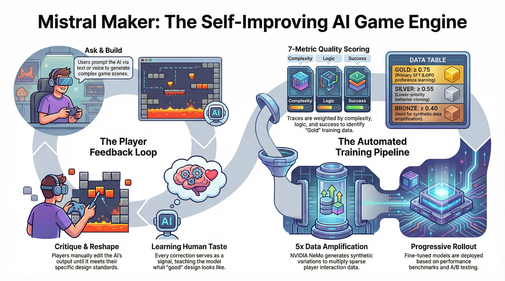

# Q-Bit and Build

**An AI game engine that learns your design taste.**

Q-Bit and Build is a prompt-driven pixel platformer where you talk to an AI to build levels, then play through them. Describe a castle entrance with skeleton guards — the AI spawns it. Don't like the layout? Critique it, drag things around, ask it to try again. When you're satisfied, click "Looks Good" and your feedback becomes training data.

Every approval and every correction feeds a live fine-tuning pipeline: traces are scored across 7 quality dimensions, classified into tiers, amplified 3-5x through NVIDIA NeMo, and used to train a student Mistral-7B model via QLoRA. The student model progressively takes over generation as it improves — measured by automated benchmarks across playability, design quality, and tool efficiency. The AI doesn't just generate levels. It learns what *your* idea of a good level looks like, and gets better at it every session.

Built for the **Mistral Worldwide Hackathon** by [Ghost Peony](https://github.com/GhostPeony).



---

## The Game

Q-Bit and Build is a **prompt-driven level builder** with a playable platformer inside it. You describe what you want in plain English (or speak it), and the AI builds it in real time on a pixel canvas. Then you switch to play mode and run through what you just made.

### Build Mode

You're looking at a 2D canvas. On the left is a sprite palette — tiles, enemies, items, decorations. On the right is a property inspector for whatever you've selected. At the bottom is a chat panel where you talk to Mistral.

**What you can do:**

- **Prompt the AI** — Type or speak: *"Build a castle entrance with two skeleton guards and a locked door."* Mistral responds with tool calls that spawn entities, set positions, add patrol routes, and wire up behaviors. You watch the level assemble itself.
- **Critique and reshape** — Don't like the placement? Say *"Move the guards further apart and add a potion behind the pillar."* The AI adjusts. Or just drag things yourself — click, drag, resize, delete, clone with Shift+click.
- **Layer system** — Levels have multiple layers connected by doors. Build a platformer dungeon, then add a topdown overworld through a portal. Each layer has its own physics mode.
- **NPC authoring** — Enemies and NPCs get patrol routes (click to place waypoints) and behavior rules. A guard can `on_proximity 120 → move_towards player 60` and `on_collision player → hurt other 1`. The AI writes these rules; you can also edit them directly.
- **Voice** — Every NPC speaks out loud. The AI assigns voice profiles when spawning characters — guards sound authoritative, healers sound warm, merchants sound persuasive. Six ElevenLabs voice profiles, real-time TTS. You can also speak your prompts instead of typing.

### Play Mode

Press the mode toggle and you're in the game. Your character spawns, gravity kicks in (or doesn't — topdown layers are 8-directional), and everything you built is live.

- **Movement**: WASD or arrow keys. Jump with Space (double-jump enabled). Attack with X. Pick up items with F.
- **Combat**: Enemies patrol their routes and attack on proximity. Melee strikes produce slash arcs and damage numbers. Kill enemies to get loot drops from configurable drop tables.
- **Inventory**: Open your backpack (B/I) to see collected items. Equip weapons, armor, and accessories into slots. Consumables (potions, food) auto-apply on pickup — heal, speed boost, ammo, score.
- **Doors**: Walk into a portal and you transition to another layer with a smooth animation. Doors can be bidirectional or one-way. The AI links them automatically when you ask for connected areas.
- **Health**: Take damage, get knocked back with invulnerability frames. Die and respawn at your spawn point after a delay. Hearts display in the HUD.

### The Feedback Loop

After the AI builds something, a **"Looks Good"** button appears. That's the moment the system captures a training trace:

- If you approve immediately → **Success trace** (SFT data). The AI got it right.
- If you critique first, then approve → **Correction trace** (DPO data). The system records what was rejected and what was chosen.

Every trace gets scored on 7 dimensions, classified into tiers (gold/silver/bronze), and fed into the training pipeline. The more you play, the better the AI gets at building levels that match your taste.

---

## How It Works

The core loop is three moves:

1. **Ask** — Tell Mistral what to build via text or voice. "A castle entrance with two guards and a locked door."
2. **Critique** — Reshape the AI's output until it looks right. Move things, delete things, ask it to try again.
3. **Train** — Your corrections become training data. The model fine-tunes on what you approved and what you rejected.

Every cycle through this loop makes the next generation better. The AI doesn't just generate levels — it learns *your* sense of what a good level looks like.

```
 ┌──────────────────────────────────────────────────────────────┐
 │                    THE FLYWHEEL                              │
 │                                                              │
 │   Player prompts ──► Mistral generates (tool calls)          │
 │         │                      │                             │
 │         │              Snapshot A (before)                    │
 │         │                      │                             │
 │         ▼                      ▼                             │
 │   Player critiques ──► AI redoes / player edits              │
 │         │                      │                             │
 │         │              Snapshot B (after)                     │
 │         │                      │                             │
 │         ▼                      ▼                             │
 │   Trace captured ──► { rejected: A, chosen: B }              │
 │         │                                                    │
 │         ▼                                                    │
 │   Quality scorer ──► Tier classification (gold/silver/...)   │
 │         │                                                    │
 │         ▼                                                    │
 │   Dataset builder ──► DPO seeds + SFT seeds                  │
 │         │                                                    │
 │         ▼                                                    │
 │   NVIDIA NeMo ──► 3-5x synthetic amplification               │
 │         │                                                    │
 │         ▼                                                    │
 │   Unsloth + QLoRA ──► Fine-tuned LoRA adapter                │
 │         │                                                    │
 │         ▼                                                    │
 │   Model deployed ──► Next generation is better ──────┐       │
 │                                                      │       │
 │   ◄──────────────────────────────────────────────────┘       │
 └──────────────────────────────────────────────────────────────┘
```

---

## Sponsor Technologies We Use

| Sponsor | How We Use It |
|---------|--------------|
| **[Mistral AI](https://mistral.ai)** | The backbone. Mistral-large powers all level generation via the Agents API with tool calling. Fine-tuned Mistral-7B models are the student models that learn from player feedback. The entire training loop targets Mistral as both teacher and student. |
| **[ElevenLabs](https://elevenlabs.io)** | Every NPC can talk. We use the Turbo v2.5 model with 6 distinct voice profiles — guards sound authoritative (Adam), healers sound warm (Rachel), merchants sound persuasive (Daniel). The AI assigns voice types when it creates NPCs, so a spawned blacksmith automatically speaks in a gruff tone. Player speech input and AI assistant responses are also spoken aloud. |
| **[NVIDIA](https://nvidia.com)** | NeMo Data Designer amplifies our training data 3–5x through Nemotron. Raw player traces are sparse — a few dozen gold-tier corrections won't move the needle. NeMo generates prompt rephrasings, scene variations, and entirely novel examples so we can train on hundreds of examples from dozens of real interactions. |
| **[Weights & Biases](https://wandb.ai)** | Weave handles trace observability — every AI generation and player correction is logged, scored, and browsable. Training runs stream loss curves and hyperparameters to W&B dashboards. Evaluation benchmarks are tracked longitudinally so we can see if each fine-tune actually improved. |
| **[Hugging Face](https://huggingface.co)** | We use both **[TRL](https://huggingface.co/docs/trl/en/index)** and **[Jobs](https://huggingface.co/docs/hub/en/jobs)**. TRL provides all three of our training strategies — `SFTTrainer` for behavior cloning, `DPOTrainer` for preference learning, and `GRPOTrainer` for group relative policy optimization. HuggingFace Jobs handles cloud training: we upload seed datasets, submit Unsloth QLoRA jobs on T4/A10G/A100 hardware, and host the resulting adapters. The `hf_cloud.py` sidecar script manages the full upload → train → deploy cycle. |

---

## Quick Start

### Prerequisites

- Node.js 18+
- Python 3.10+ (for Weave sidecar and training scripts)
- API keys (see below)

### Install

```bash
git clone https://github.com/GhostPeony/mistral-maker.git
cd mistral-maker
npm install
cp .env.example .env
```

### Configure `.env`

```env
MISTRAL_API_KEY=       # Required — Mistral AI for generation + fine-tuning
ELEVENLABS_API_KEY=    # Optional — NPC voices (6 profiles), AI assistant speech
WANDB_API_KEY=         # Optional — Weights & Biases training dashboards
HF_TOKEN=             # Optional — HuggingFace cloud training jobs
NVIDIA_API_KEY=        # Optional — NeMo Data Designer amplification
```

### Run

```bash
# Terminal 1: Express server (port 3001)
npm run dev:server

# Terminal 2: Vite dev server (game)
npm run dev:game

# Terminal 3 (optional): Weave sidecar (port 3002)
cd server/weave-sidecar && pip install -r requirements.txt && python app.py
```

### Entry Points

| URL | What It Is |
|-----|-----------|
| `http://localhost:5173` | Landing page — character select, then into the editor |
| `http://localhost:5173/game` | Game editor — build mode + play mode + AI chat |
| `http://localhost:5173/dashboard` | Training dashboard — traces, scoring, pipeline controls |

---

## Architecture

```
mistral/
├── game/                          # Vite + TypeScript
│   ├── landing.html               # Landing page with character select
│   ├── dashboard.html             # Training pipeline dashboard
│   └── src/
│       ├── main.ts                # Game bootstrap, ECS wiring, game loop
│       ├── ecs/                   # Entity Component System core
│       │   ├── types.ts           # 14 component types + entity definition
│       │   └── world.ts          # World state, queries, undo stack, serialization
│       ├── engine/
│       │   ├── game-loop.ts       # Fixed-step update + render loop
│       │   ├── renderer.ts        # Canvas 2D renderer, camera, depth sorting
│       │   └── background.ts      # Parallax sky and clouds
│       ├── systems/               # ECS systems (execution order matters)
│       │   ├── input.ts           # WASD/Arrow keys, jump, game mode switching
│       │   ├── physics.ts         # Gravity, AABB collision, friction
│       │   ├── health.ts          # HP, invulnerability, death/respawn
│       │   ├── patrol.ts          # Waypoint-based NPC movement
│       │   ├── combat.ts          # Melee/ranged attacks, pickups, loot drops
│       │   ├── door.ts            # Portal entities, layer transitions
│       │   └── layer-manager.ts   # Multi-layer scenes, transition animations
│       ├── ai/
│       │   ├── mistral-client.ts  # Conversation history, dynamic world context
│       │   └── tool-definitions-extended.ts  # 16 tool definitions
│       ├── telemetry/
│       │   ├── types.ts           # SuccessTrace, CorrectionTrace, CognitiveData
│       │   ├── trace-capture.ts   # Snapshot lifecycle, diff generation
│       │   └── session.ts         # Batch trace submission
│       ├── ui/                    # Editor panels and overlays
│       │   ├── chat-panel.ts      # AI conversation overlay
│       │   ├── toolbar.ts         # Top bar: save/load/export, server status
│       │   ├── context-panel.ts   # Entity property inspector (right sidebar)
│       │   ├── asset-browser.ts   # Sprite palette (left sidebar)
│       │   ├── canvas-interaction.ts  # Selection, drag, resize, pan, zoom
│       │   ├── mode-toggle.ts     # Build/Play mode + layer controls
│       │   ├── backpack-panel.ts  # Inventory and equipment management
│       │   ├── pixel-editor.ts    # In-editor sprite creation tool
│       │   ├── context-menu.ts    # Right-click entity actions
│       │   ├── help-overlay.ts    # Keyboard shortcuts reference
│       │   ├── pause-menu.ts      # Pause/resume during play mode
│       │   └── settings-panel.ts  # Physics and player config
│       ├── dashboard/             # Dashboard tab components
│       │   ├── stats-tab.ts       # Trace counts, tier distribution, pipeline flow
│       │   ├── traces-tab.ts      # Browsable trace list with filters
│       │   ├── training-tab.ts    # 3-step pipeline UI
│       │   └── models-tab.ts      # Training run list, adapter paths
│       ├── assets/
│       │   └── sprites.ts         # 50+ pixel art sprites (heroes, enemies, tiles)
│       ├── config/
│       │   └── game-config.ts     # Physics, player, editor constants
│       └── data/
│           └── loot-tables.ts     # Enemy drop tables
│
├── server/                        # Express + TypeScript
│   ├── index.ts                   # Server bootstrap, route mounting (port 3001)
│   ├── routes/
│   │   ├── ai.ts                  # Chat endpoint, agent management, model routing
│   │   ├── traces.ts              # Trace storage (JSONL) and retrieval
│   │   ├── pipeline.ts            # Seed building, amplification, training, orchestrator
│   │   ├── eval.ts                # Benchmark runner, result comparison
│   │   ├── levels.ts              # Level save/load (JSON files)
│   │   └── voice.ts               # ElevenLabs TTS proxy
│   ├── ai/
│   │   ├── agent-manager.ts       # Mistral Agents API with completions fallback
│   │   └── model-router.ts        # Teacher/student routing, progressive rollout
│   ├── pipeline/
│   │   ├── types.ts               # Pipeline type definitions
│   │   ├── scorer.ts              # 7-metric weighted quality scoring
│   │   ├── data-designer.ts       # NVIDIA NeMo integration, dataset generation
│   │   ├── trainer.ts             # Unsloth + QLoRA training script generation
│   │   ├── orchestrator.ts        # Automated pipeline loop (30s polling)
│   │   ├── quality-gate.ts        # 3-dimension tier classification
│   │   └── threshold-monitor.ts   # Watermark-based triggers, cooldowns
│   ├── eval/
│   │   ├── runner.ts              # Benchmark execution, tool replay
│   │   ├── comparator.ts          # A/B model comparison
│   │   ├── prompts/
│   │   │   └── eval-tasks.ts      # 14 benchmark tasks (simple/medium/complex)
│   │   └── dimensions/
│   │       ├── playability.ts     # Reachability, enemy placement, door links
│   │       ├── tool-efficiency.ts # Efficiency ratio, error rate, batching
│   │       └── design-quality.ts  # Variety, composition, thematic coherence
│   └── weave-sidecar/             # Python service (port 3002)
│       ├── app.py                 # FastAPI server, Weave trace logging
│       ├── scorer.py              # Python-side quality scoring
│       ├── amplify.py             # NVIDIA NeMo data expansion
│       └── hf_cloud.py            # HuggingFace cloud training + deployment
│
└── .mistral-maker/                # Local data directory (gitignored)
    ├── traces.jsonl               # Append-only player traces
    ├── datasets/                  # Training-ready seeds
    ├── levels/                    # Saved level JSON files
    └── models/                    # Trained LoRA adapters
```

### Tech Stack

| Layer | Technology |
|-------|-----------|
| Game engine | Custom ECS + Canvas 2D (TypeScript, Vite) |
| AI generation | Mistral AI — Agents API + tool-calling completions |
| Voice | ElevenLabs Turbo v2.5 (6 NPC voices + assistant), Web Speech API STT |
| Training | Unsloth + QLoRA (4-bit), SFT / DPO / GRPO |
| Cloud training | HuggingFace Jobs |
| Data amplification | NVIDIA NeMo Data Designer (Nemotron) |
| Observability | Weights & Biases + Weave |
| Server | Express.js + better-sqlite3 |
| Sidecar | Python + FastAPI |

---

## The Game Engine

### ECS Architecture

Everything in the game world is an **entity** — a bag of **components** queried by **systems**. No inheritance, no god objects. The `World` class holds all entities and supports serialization, undo (50 levels), and filtered queries.

#### Component Types

| Component | Fields | Purpose |
|-----------|--------|---------|
| `position` | `x, y` | World coordinates |
| `sprite` | `assetId, width, height, flipX, hueShift` | What it looks like |
| `physics` | `velocityX, velocityY, gravity, solid` | How it moves and collides |
| `health` | `hp, maxHp, invulnerableTimer, spawnX, spawnY, respawnDelay` | Life and death |
| `patrol` | `waypoints[], currentIndex, speed, loop, direction` | Waypoint-based AI movement |
| `facing` | `direction: left\|right\|up\|down` | Character orientation |
| `behavior` | `rules[]` (trigger + action pairs) | Declarative AI rules |
| `equipment` | `slots: { weapon, armor, accessory }` | Item slot system |
| `inventory` | `items[], capacity` | Carried items |
| `pickup` | `itemDef` | Marks entity as collectible |
| `consumable` | `effect: heal\|speed\|ammo\|score, value` | Auto-apply on overlap |
| `layer` | `layerId` | Which scene layer this entity lives on |
| `door` | `destinationId, bidirectional` | Portal to another layer |
| `moveTo` | `targetX, targetY, speed` | Programmatic movement target |

#### Behavior Rules DSL

The behavior system uses a trigger → action rule engine that the AI can author. Triggers fire every frame; actions execute when conditions are met.

```
Triggers:                          Actions:
  on_proximity <distance>            hurt <self|other> <amount>
  on_collision <target>              move_towards <target> <speed>
  on_interval <ms>                   flee_from <target> <speed>
  on_low_health                      say <text>
  always                             say_voice <npc_type>
                                     destroy self
                                     teleport <x> <y>
                                     set_physics gravity <bool>
```

### Systems Execution Order

Systems run every frame in this exact order. The sequence matters — physics must resolve before combat can check overlaps, input must be read before facing can update.

```
1. InputSystem        — Read keyboard state, apply movement
2. FacingSystem       — Orient character based on velocity
3. PhysicsSystem      — Gravity, velocity integration, AABB collision
4. HealthSystem       — Invulnerability timers, death, respawn
5. PatrolSystem       — Waypoint pathfinding for NPCs
6. BehaviorSystem     — Evaluate trigger-action rules
7. CombatSystem       — Attacks, pickups, loot drops, damage numbers
8. DoorSystem         — Portal detection, layer transitions
9. VFXSystem          — Age and expire transient effects
10. Renderer          — Camera follow, depth sort, sprite draw
```

### Renderer

Canvas 2D with pixel-perfect rendering (`imageSmoothingEnabled = false`). All sprites are pre-rendered to offscreen canvases on startup and cached. The renderer handles:

- **Camera**: Smooth follow with easing, configurable zoom (0.25x–4x)
- **Depth sorting**: Entities sorted by Y coordinate before drawing
- **Layer filtering**: Off-layer entities drawn at 30% alpha
- **VFX overlay**: Damage numbers, slash arcs, speech bubbles, pickup prompts
- **Build mode**: Grid overlay, selection highlights, resize handles, patrol path visualization
- **Hue shifting**: NPCs can be recolored via component property without new sprites

### Game Modes

Each layer can be either **platformer** (gravity, jumping, fall death) or **topdown** (8-directional, no gravity). Doors can transition between layers of different modes — walk through a door in a platformer dungeon and emerge in a topdown overworld.

---

## AI in the Game

### Chat → Tool Loop → World Mutation

When a player sends a message, the flow is:

1. **MistralClient** serializes current world state as dynamic context
2. Server routes to **AgentManager** (Mistral Agents API with connectors, or raw completions fallback)
3. **ModelRouter** decides teacher vs student model
4. Mistral responds with **tool calls** (spawn entities, modify properties, delete, etc.)
5. Client-side **ToolExecutor** dispatches each call against the live ECS World
6. Results sent back for follow-up turns until the model emits a text response

### Tool Definitions

16 tools are available to the AI — 12 core mutation tools and 4 read-only query tools:

**Core tools**: `spawn_entities`, `delete_entity`, `move_entity`, `resize_entity`, `set_sprite`, `set_physics`, `set_health`, `add_patrol`, `add_behavior`, `link_doors`, `equip_item`, `clear_world`

**Extended tools**: `query_world` (entity counts, spatial queries), `validate_level` (reachability, bounds, door links), `search_inspiration` (design reference), `lookup_sprite_catalog` (browse available sprites)

### Voice

Every NPC can speak — out loud, with a unique voice. This isn't canned audio; it's real-time text-to-speech powered by **ElevenLabs**.

**The pipeline:**
1. A behavior rule triggers `say_voice <npc_type>` (e.g., on player proximity)
2. `DialogueManager` picks a weighted-random line from that NPC type's dialogue pool
3. `VoiceService` sends the text to `/api/voice/tts` → server proxies to ElevenLabs (`eleven_turbo_v2_5` model)
4. Audio plays via Web Audio API while a speech bubble floats above the NPC
5. Per-NPC cooldowns (20–30s) prevent spam; audio responses are cached by `voiceId:text` key

**Six distinct voice profiles:**

| NPC Type | ElevenLabs Voice | Character |
|----------|-----------------|-----------|
| `npc_guard` | Adam | Deep, authoritative |
| `npc_blacksmith` | Arnold | Gruff, strong |
| `npc_healer` | Rachel | Warm, gentle |
| `npc_elder` | Harry | Older, wise |
| `npc_villager` | Sarah | Casual, friendly (default) |
| `npc_merchant` | Daniel | Energetic, persuasive |

The AI can assign any of these types when spawning NPCs with `add_behavior` rules, giving each character a fitting voice without any manual audio work.

**Speech bubbles** render as dark rounded rectangles above the NPC with word-wrapped text, a tail triangle pointing down, and a fade-out over the last 20% of their 3.5-second lifetime.

**Player voice input** uses the Web Speech API — click the mic button in the chat panel, speak your prompt, and it transcribes to text for the AI conversation. AI assistant responses are also spoken aloud using the default voice.

---

## The Training Loop

This is the core of the project. Every player interaction generates signal. That signal gets scored, filtered, amplified, and used to fine-tune the model. Here's each stage in detail.

### Stage 1: Trace Capture

When a player interacts with the AI, the telemetry system captures a **trace** — a structured record of what happened.

**Lifecycle:**
1. `captureAISnapshot(world, prompt, toolCalls)` — Record world state before + the AI's tool calls
2. Player either approves or critiques. If critiquing: `addCritique(text)` accumulates feedback
3. `capturePlayerApproval(world)` — Record final world state, generate trace

**Two trace types emerge:**

| Type | When | Structure |
|------|------|-----------|
| **SuccessTrace** | Player approves first attempt | `{ prompt, output: { entities, toolCalls }, score }` |
| **CorrectionTrace** | Player corrects then approves | `{ prompt, rejected: { entities, toolCalls }, chosen: { entities, toolCalls }, feedback, critiques[], attempts }` |

Both include `CognitiveData` when available — the model's thinking, planning, and reflection signals captured as first-class training features.

Traces are appended to `~/.mistral-maker/traces.jsonl` and forwarded to the Weave sidecar for W&B logging.

### Stage 2: Quality Scoring

Not all traces are created equal. The scorer evaluates each trace on 7 weighted metrics:

| Metric | Weight | What It Measures |
|--------|--------|------------------|
| Success rate | 25% | Did the player approve? How many attempts? |
| Verification | 20% | 1.0 for success traces, 0.5 for corrections |
| Cognitive quality | 15% | Thinking depth, plan coherence, error reflection |
| Complexity | 15% | Unique entity types + behavior rule diversity |
| Tool diversity | 10% | Variety of tools used vs total available |
| Efficiency | 10% | Fewer attempts = higher score. Penalizes 0.2 per retry |
| Length | 5% | Gaussian curve centered on ~10 entities (not too few, not too many) |

The weighted sum determines the **tier**:

| Tier | Threshold | Used For |
|------|-----------|----------|
| **Gold** | ≥ 0.75 and ≤ 2 attempts | SFT training, DPO chosen examples |
| **Silver** | ≥ 0.55 | SFT training with lower priority |
| **Bronze** | ≥ 0.40 | Held for amplification; marginal quality |
| **Failed** | < 0.40 | Discarded |

### Stage 3: Dataset Building

The pipeline filters traces by tier and builds two seed files:

- **`sft_seeds.jsonl`** — Success traces (gold/silver). Each seed is a prompt → tool call sequence the model should learn to reproduce.
- **`dpo_seeds.jsonl`** — Correction traces. Each seed is a `{ prompt, rejected, chosen }` triple — the model learns to prefer the player-approved version.

Seeds are deduplicated by prompt similarity and capped at a configurable maximum.

### Stage 4: Data Amplification

Raw player traces are sparse. NVIDIA NeMo Data Designer (via Nemotron) amplifies the dataset 3–5x through:

- **SFT amplification**: Prompt rephrasings + scene variations on successful examples
- **DPO amplification**: New rejected/chosen pairs + prompt rephrasings
- **Novel scene generation**: Entirely new examples generated from scratch using the trace distribution as a template

The amplification runs via `amplify.py` in the Weave sidecar, calling the NVIDIA NIM API. If NeMo is unavailable, training proceeds with raw seeds only.

### Stage 5: Training

Fine-tuning uses **Unsloth + QLoRA** (4-bit quantization) for fast, memory-efficient training.

**Base model**: `unsloth/mistral-7b-instruct-v0.3`

**Training methods:**

| Method | Input | Purpose |
|--------|-------|---------|
| SFT | `sft_seeds.jsonl` | Behavior cloning from successful generations |
| DPO | `dpo_seeds.jsonl` | Preference learning — chosen vs rejected |
| GRPO | `sft_seeds.jsonl` | Group relative policy optimization |
| Distillation | Teacher completions | Knowledge transfer from large to small model |

**Default hyperparameters:**
- LoRA rank: 32, alpha: 64, dropout: 0.05
- Target modules: `q_proj`, `k_proj`, `v_proj`, `o_proj`, `gate_proj`, `up_proj`, `down_proj`
- Max sequence length: 2048
- Batch size: 1, gradient accumulation: 8
- Learning rate: 2e-5, warmup: 10%
- Max steps: 60

**Two training modes:**
- **Local**: Generates a Python training script and runs it with your GPU
- **Cloud**: Uploads seeds to HuggingFace, submits a training job via `hf_cloud.py` (T4, A10G, or A100 hardware)

Adapters are saved to `~/.mistral-maker/models/run_{timestamp}/adapter/`.

### Stage 6: Evaluation

After training, the model runs against **14 benchmark tasks** across three difficulty tiers.

**Tasks:**

| Tier | Count | Examples |
|------|-------|---------|
| Simple | 5 | "10 grass platforms", "skeleton patrol", "stone staircase" |
| Medium | 5 | "castle entrance with guards", "lava crossing", "forest with wolf" |
| Complex | 4 | "dungeon room with locked door + key + guards", "boss arena", "multi-level tower" |

Each task is scored on **3 dimensions:**

**Playability (40% of gate)**
- Platform reachability (can the player reach everything?)
- Enemy placement (are enemies on solid ground?)
- Door links (do portals connect properly?)
- Entity bounds (is everything on-canvas?)
- Difficulty balance (enemy density, item distribution)

**Design Quality (35% of gate)**
- Entity variety (unique sprites vs total entities)
- Spatial composition (spread across canvas, clustering penalty)
- Thematic coherence (LLM-as-judge: does it match the prompt?)
- Naming quality (descriptive names vs generic `entity_1`)
- Decoration density (functional vs decorative ratio)
- Creativity (LLM-as-judge: originality assessment)

**Tool Efficiency (25% of gate)**
- Efficiency ratio (entities created per tool call)
- Error rate (failed vs total calls)
- Tool diversity (variety of tools used)
- Redundancy (move/resize immediately after spawn = penalty)
- Batching quality (entities per spawn call)

The **Model Comparator** supports A/B testing — run the same benchmarks on two models and get per-task and per-dimension deltas with statistical significance flags (> 5% difference).

### Stage 7: Model Routing

The trained student model doesn't replace the teacher — it's **progressively rolled out** alongside it.

**Routing strategies:**

| Strategy | How It Routes |
|----------|--------------|
| `teacher_only` | Always use mistral-large-latest |
| `student_only` | Always use the fine-tuned model |
| `confidence_based` | Student if its success rate ≥ threshold (default 0.7) |
| `task_complexity` | Student for simple prompts (≤ 0.4 complexity), teacher for complex |
| `progressive` | Probabilistic: student handles N% of requests, increasing over time |

**Progressive rollout** starts at 10% student traffic. If eval scores improve, the rate increments (configurable 5–15% steps) up to a maximum of 90%. If scores regress, the rate decreases.

Deploy a fine-tuned model:
```bash
curl -X POST http://localhost:3001/api/ai/deploy-student \
  -H "Content-Type: application/json" \
  -d '{"modelId": "ft:open-mistral-7b:your-adapter-id"}'
```

### The Orchestrator

The orchestrator ties all stages together in an automated loop.

**Three modes:**
- **Manual** — You trigger each step from the dashboard
- **Semi-auto** — Scoring runs continuously, alerts when thresholds hit, waits for manual trigger
- **Full-auto** — End-to-end: score → amplify → train → eval → deploy, all automatic

**Polling cycle** (30-second interval in auto modes):
1. Score all unscored traces → tier classification
2. Check amplification threshold (e.g., 10 new gold traces since last amplification)
3. Check training threshold (e.g., 100 new examples since last training), respecting cooldowns and daily limits
4. If training completed, optionally run evaluation
5. If eval improved, increment student traffic rate

**Watermarks** prevent duplicate triggers — each threshold remembers the count at which it last fired.

---

## The Dashboard

The training dashboard (`/dashboard`) has four tabs:

### Stats
- 6 metric cards: total traces, success rate, corrections, gold count, cognitive data %, NeMo status
- Tier distribution bar (gold/silver/bronze/failed with percentages)
- Scoring weights reference table
- 5-step pipeline flow visualization: Play → Capture → Score → Amplify → Train
- Recent activity feed (last 8 traces with SFT/DPO badges)

### Traces
- Browsable trace list in reverse chronological order
- Filter by type (success/correction) and search by prompt text
- Expandable detail view: prompt, context (model, session), output snapshots, feedback, cognitive data

### Training
- **Step 1 — Build Seeds**: Configure min tier, deduplication, max seed count
- **Step 2 — Amplify**: NeMo status indicator, amplification factor and method display
- **Step 3 — Train**: Backend selection (cloud/local), hardware tier (T4/A10G/A100), LoRA configuration (rank, steps, learning rate)

### Models
- List of completed training runs with timestamps
- Adapter status badges (READY / TRAINING)
- Copy adapter path for deployment

---

## API Reference

### AI

| Method | Endpoint | Purpose |
|--------|----------|---------|
| POST | `/api/ai/chat` | Chat with Mistral (routed via ModelRouter) |
| POST | `/api/ai/agent/create` | Create or update Mistral Agent |
| GET | `/api/ai/agent/status` | Agent health + router metrics |
| POST | `/api/ai/router/config` | Update routing strategy |
| GET | `/api/ai/scaffolding` | Scaffolding reduction metrics |
| POST | `/api/ai/deploy-student` | Deploy fine-tuned student model |

### Traces

| Method | Endpoint | Purpose |
|--------|----------|---------|
| POST | `/api/traces` | Submit trace (appends to JSONL) |
| GET | `/api/traces` | Retrieve all traces |

### Pipeline

| Method | Endpoint | Purpose |
|--------|----------|---------|
| GET | `/api/pipeline/status` | Trace counts, tiers, NeMo status |
| POST | `/api/pipeline/build-seeds` | Build SFT + DPO seed datasets |
| POST | `/api/pipeline/amplify` | Amplify seeds via NeMo |
| POST | `/api/pipeline/train` | Launch training (cloud or local) |
| GET | `/api/pipeline/models` | List trained model runs |
| POST | `/api/pipeline/config` | Update orchestrator thresholds |
| POST | `/api/pipeline/start` | Start automated pipeline |
| POST | `/api/pipeline/stop` | Stop automated pipeline |
| POST | `/api/pipeline/step/:name` | Run single step (score/amplify/train/eval) |

### Evaluation

| Method | Endpoint | Purpose |
|--------|----------|---------|
| POST | `/api/eval/run` | Run benchmark suite on a model |
| GET | `/api/eval/status/:id` | Poll benchmark progress |
| GET | `/api/eval/results` | List completed benchmarks |
| GET | `/api/eval/compare` | A/B comparison of two results |

### Levels

| Method | Endpoint | Purpose |
|--------|----------|---------|
| POST | `/api/levels/save` | Save level JSON |
| GET | `/api/levels` | List saved levels |
| GET | `/api/levels/:name` | Load specific level |

---

## Observability

### Weave Sidecar

A Python FastAPI service running on port 3002 that bridges the TypeScript server with W&B Weave:

- **Trace logging**: Every submitted trace is forwarded to Weave for persistent storage and visualization
- **Scoring**: Dual scorer architecture — TypeScript scorer runs in the Express server, Python scorer runs in the sidecar for Weave-native logging
- **Evaluation**: Triggered from the dashboard, runs benchmark tasks and logs results to W&B
- **Dataset publishing**: Seeds published as Weave Datasets before training for artifact tracking

### Weights & Biases

- Training runs logged with full hyperparameters, loss curves, and adapter artifacts
- Evaluation results tracked per model for longitudinal comparison
- Dashboard metrics (trace counts, tier distribution) available in W&B project views

Configure via environment:
```env
WANDB_API_KEY=your-key
WANDB_PROJECT=mistral-maker       # W&B project name
WEAVE_PROJECT=your-entity/mistral-maker  # Weave project path
```

---

## Keyboard Shortcuts

### Build Mode

| Key | Action |
|-----|--------|
| `T` | Toggle chat panel |
| `G` | Toggle grid snap |
| `Del` / `Backspace` | Delete selected entity |
| `Ctrl+Z` | Undo |
| `Shift+Click` | Clone entity |
| `Middle-click drag` | Pan camera |
| `Scroll wheel` | Zoom |
| `B` / `I` | Open backpack |
| `?` | Help overlay |
| `Escape` | Pause menu |

### Play Mode

| Key | Action |
|-----|--------|
| `A` / `D` or Arrows | Move left/right |
| `Space` / `W` / `Up` | Jump (double-jump enabled) |
| `F` | Pick up item |
| `X` | Attack |
| `Escape` | Pause |

---

## Credits

- [Mistral AI](https://mistral.ai) — LLM inference, Agents API, fine-tuning target
- [ElevenLabs](https://elevenlabs.io) — Voice synthesis: 6 distinct NPC voices via Turbo v2.5
- [NVIDIA NeMo Data Designer](https://developer.nvidia.com/nemo) — Synthetic data amplification via Nemotron
- [Weights & Biases](https://wandb.ai) — Training metrics, Weave trace observability
- [HuggingFace](https://huggingface.co) — Model hosting and cloud training jobs
- [Unsloth](https://unsloth.ai) — Fast QLoRA fine-tuning

## License

MIT
